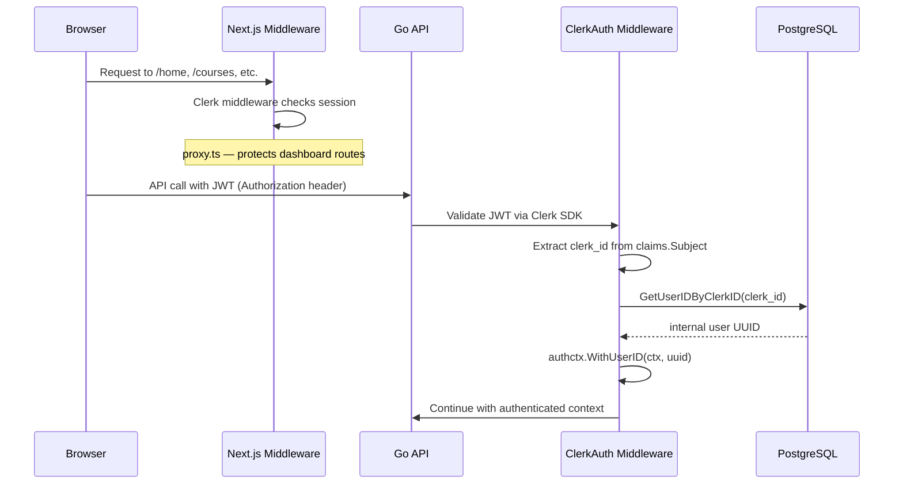
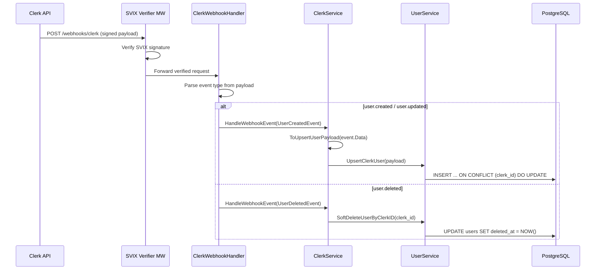

# Authentication Flow

AskAtlas uses [Clerk](https://clerk.com) for authentication. The flow spans both frontend and backend with two distinct paths: **request authentication** and **webhook sync**.

## Request Authentication

Every authenticated API request follows this flow:



### Frontend: Route Protection

The Next.js middleware (`proxy.ts`) uses Clerk's `createRouteMatcher` to protect dashboard routes:

```typescript
const isDashboardRoute = createRouteMatcher([
  "/home(.*)",
  "/courses(.*)",
  "/resources(.*)",
  "/study-guides(.*)",
  "/me(.*)",
]);

export default clerkMiddleware(async (auth, req) => {
  if (isDashboardRoute(req)) {
    await auth.protect();
  }
});
```

Unauthenticated users hitting any dashboard route are redirected to Clerk's sign-in page. Marketing pages remain public.

### Backend: JWT Resolution

The `ClerkAuth` middleware (`internal/middleware/clerk_auth.go`) performs three steps:

1. **Validate JWT** — Uses `clerkhttp.WithHeaderAuthorization()` to verify the token with Clerk's API
2. **Extract Clerk ID** — Reads `claims.Subject` from the validated session
3. **Resolve to internal UUID** — Calls `GetUserIDByClerkID` to map the external Clerk ID to our internal `users.id`

The resolved UUID is injected into the request context via `authctx.WithUserID()`, making it available to all downstream handlers via `authctx.UserIDFromContext()`.

#### What If the User Doesn't Exist?

If `GetUserIDByClerkID` returns `sql.ErrNoRows` (user not in our database), the middleware returns **401 Unauthorized**. This can happen if the Clerk webhook hasn't been processed yet — see the webhook section below.

## Webhook Sync

Clerk sends webhook events when users are created, updated, or deleted. These keep our local database in sync.



### Key Design Decisions

- **Upsert on create and update** — Both `user.created` and `user.updated` events use the same `UpsertClerkUser` query with `ON CONFLICT (clerk_id) DO UPDATE`. This makes the system idempotent — replaying events is safe.
- **Soft delete** — `user.deleted` sets `deleted_at` rather than removing the row. This preserves referential integrity (files, grants, etc. still reference the user).
- **SVIX signature verification** — The webhook endpoint is protected by SVIX middleware that validates the request signature using the `CLERK_WEBHOOK_SECRET`.

### Event Types

| Clerk Event | Handler Action | SQL Operation |
|------------|----------------|---------------|
| `user.created` | `handleUserCreated` → `handleUserUpdated` | `INSERT ... ON CONFLICT DO UPDATE` |
| `user.updated` | `handleUserUpdated` | `INSERT ... ON CONFLICT DO UPDATE` |
| `user.deleted` | `handleUserDeleted` | `UPDATE ... SET deleted_at = NOW()` |
| Unknown | Logged as warning, ignored | None |
