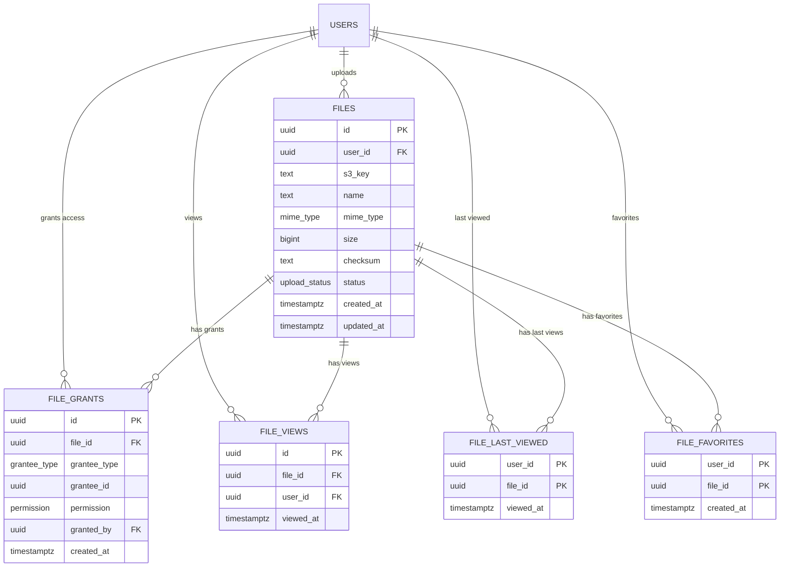

# Files Data Model

The files domain manages uploaded documents, access control, view tracking, and favorites.

## Object Storage

File content is stored in [Garage](https://garagehq.deuxfleurs.fr/), an S3-compatible object storage system. The `files.s3_key` column stores the object key for each file. Uploads and downloads are orchestrated via the S3 API.

> **Note:** The upload/download pipeline is planned for a future sprint. The current schema and API support the metadata layer — file content transfer will be implemented when the S3 integration is wired up.

## Entity Relationship

## Tables

### `files`

Core file metadata. Each file is owned by a user and stored in object storage.

| Column | Type | Purpose |
|--------|------|---------|
| `id` | UUID | Primary key |
| `user_id` | UUID | Owner (FK to `users`, `ON DELETE RESTRICT`) |
| `s3_key` | TEXT | Object storage key |
| `name` | TEXT | Display name |
| `mime_type` | ENUM | `image/jpeg`, `image/png`, `image/webp`, `application/pdf` |
| `size` | BIGINT | File size in bytes |
| `checksum` | TEXT | Integrity hash |
| `status` | ENUM | `pending`, `complete`, `failed` |
| `created_at` | TIMESTAMPTZ | Upload time |
| `updated_at` | TIMESTAMPTZ | Last modification |

> **`ON DELETE RESTRICT`** on `user_id` means you cannot hard-delete a user who has files. This is intentional — users are soft-deleted.

### `file_grants`

Access control. Grants a permission to a grantee (user, course, or study guide) on a file.

| Column | Type | Purpose |
|--------|------|---------|
| `file_id` | UUID | Target file |
| `grantee_type` | ENUM | `user`, `course`, `study_guide` |
| `grantee_id` | UUID | ID of the grantee entity |
| `permission` | ENUM | `view`, `share`, `delete` |
| `granted_by` | UUID | User who granted access |

A **public sentinel** uses `grantee_type = 'user'` with `grantee_id = '00000000-0000-0000-0000-000000000000'` to represent public access.

**Unique constraint:** `(file_id, grantee_type, grantee_id, permission)` — prevents duplicate grants.

### `file_views`

Append-only log of every file view. Used for analytics (total views, time-series).

### `file_last_viewed`

Denormalized "most recent view" per user per file. Primary key is `(user_id, file_id)`, optimized for "show my recently viewed files."

### `file_favorites`

User favorites. Primary key is `(user_id, file_id)`, optimized for "show my favorited files."

## Enums

| Enum | Values |
|------|--------|
| `grantee_type` | `user`, `course`, `study_guide` |
| `upload_status` | `pending`, `complete`, `failed` |
| `mime_type` | `image/jpeg`, `image/png`, `image/webp`, `application/pdf` |
| `permission` | `view`, `share`, `delete` |

## Extensions

| Extension | Purpose |
|-----------|---------|
| `pgcrypto` | UUID generation (`gen_random_uuid()`) |
| `pg_trgm` | Trigram indexing for filename search (`ILIKE '%term%'`) |

## Indexing Strategy

### Files Table

| Index | Columns | Purpose |
|-------|---------|---------|
| `idx_files_user_created_id` | `(user_id, created_at, id)` | "My files sorted by upload date" with keyset pagination |
| `idx_files_user_updated_id` | `(user_id, updated_at, id)` | "My files sorted by last update" with keyset pagination |
| `idx_files_user_lower_name_id` | `(user_id, lower(name), id)` | Case-insensitive name sort |
| `idx_files_user_size_id` | `(user_id, size, id)` | Sort by file size |
| `idx_files_user_status_id` | `(user_id, status, id)` | Sort by upload status |
| `idx_files_user_mime_id` | `(user_id, mime_type, id)` | Sort by MIME type |
| `idx_files_name_trgm` | `name (GIN, gin_trgm_ops)` | Fast `ILIKE '%term%'` filename search |

### Why Keyset Pagination?

All list indexes include `id` as a tiebreaker column, enabling **keyset (cursor-based) pagination** instead of `OFFSET`. This is more efficient at scale because:
- `OFFSET N` requires scanning and discarding N rows
- Keyset uses `WHERE (sort_col, id) > (cursor_value, cursor_id)` which seeks directly via index

### Grants, Views, and Favorites

| Index | Purpose |
|-------|---------|
| `idx_file_grants_grantee_perm_file` | "What files does this grantee have access to?" |
| `idx_file_grants_file_id` | "Who has access to this file?" |
| `idx_file_views_file_id` | View analytics per file |
| `idx_file_views_user_id` | "All files this user has viewed" |
| `idx_file_last_viewed_user_viewed_file` | "Recently viewed files" with pagination |
| `idx_file_favorites_user_created_file` | "My favorites" with pagination |
| `idx_file_favorites_file_id` | Favorite counts per file |
