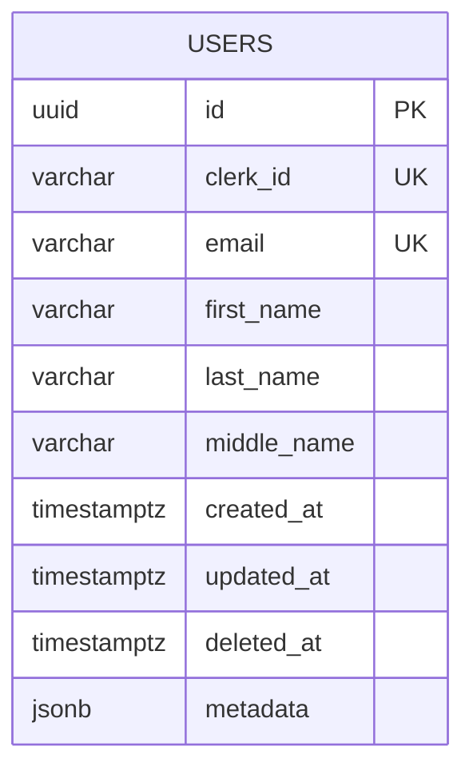

# Users Data Model

## Entity Relationship



## Schema

The `users` table stores all registered AskAtlas users, synced from Clerk via webhooks.

```sql
CREATE TABLE users (
    id UUID PRIMARY KEY DEFAULT gen_random_uuid(),
    clerk_id VARCHAR(255) UNIQUE NOT NULL,
    email VARCHAR(255) UNIQUE NOT NULL,
    first_name VARCHAR(255) NOT NULL,
    last_name VARCHAR(255) NOT NULL,
    middle_name VARCHAR(255),
    created_at TIMESTAMPTZ NOT NULL DEFAULT NOW(),
    updated_at TIMESTAMPTZ NOT NULL DEFAULT NOW(),
    deleted_at TIMESTAMPTZ,
    metadata JSONB DEFAULT '{}'::jsonb
);
```

### Key Columns

| Column | Purpose |
|--------|---------|
| `id` | Internal UUID, used as the primary key across all tables |
| `clerk_id` | External Clerk user ID, used for webhook lookups and auth middleware resolution |
| `email` | Unique email, synced from Clerk |
| `deleted_at` | Soft-delete timestamp — `NULL` means active |
| `metadata` | Flexible JSONB field for future extensibility |

## Soft Delete Pattern

Users are **never hard-deleted**. When Clerk sends a `user.deleted` event, we set `deleted_at = NOW()`. This preserves referential integrity — files, grants, and other records still reference the user.

The `UpsertClerkUser` query also clears `deleted_at` back to `NULL`, allowing a user to be "undeleted" if Clerk recreates them.

## Indexes

| Index | Purpose |
|-------|---------|
| `idx_users_deleted_at` | Partial index on `deleted_at IS NULL` — fast lookups of active users |
| `idx_users_active_email` | Partial index on `email WHERE deleted_at IS NULL` — email lookups for active users only |

## SQL Queries

| Query | Purpose |
|-------|---------|
| `UpsertClerkUser` | Insert or update user from Clerk webhook data (idempotent) |
| `SoftDeleteUserByClerkID` | Set `deleted_at = NOW()` for a user by Clerk ID |
| `GetUserIDByClerkID` | Resolve Clerk ID to internal UUID (used by auth middleware) |
