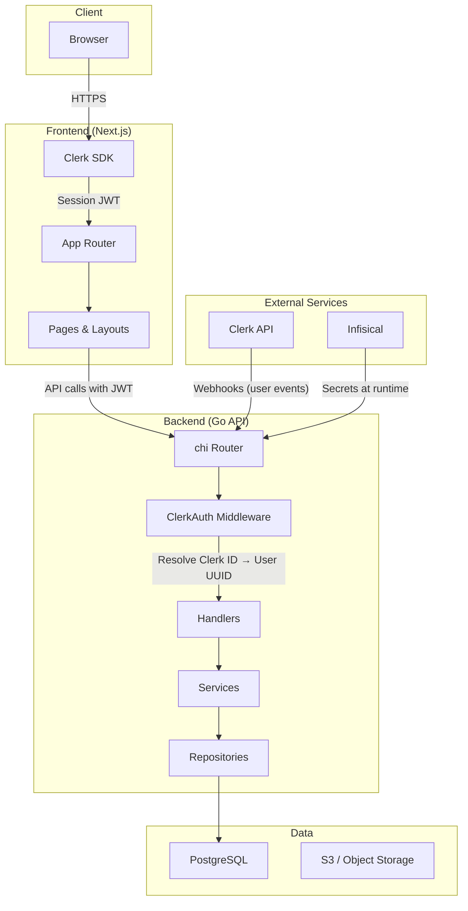

# System Overview

AskAtlas is a full-stack application with a Go backend API, Next.js frontend, and PostgreSQL database, deployed to Digital Ocean via Docker containers.

## Architecture Diagram



## Component Responsibilities

### Frontend (`web/`)
- **App Router** — Next.js pages and layouts using route groups (`(dashboard)`, `(marketing)`)
- **Clerk SDK** — Client-side authentication, session management, and route protection via middleware
- **Feature modules** — Business logic and UI components organized under `lib/features/`

### Backend (`api/`)
- **chi Router** — HTTP routing with middleware chain (request ID, logging, auth, timeout)
- **ClerkAuth Middleware** — Validates Clerk JWTs, resolves external Clerk IDs to internal user UUIDs
- **Handlers** — HTTP request/response handling, parameter parsing, error responses
- **Services** — Business logic, validation, data transformation
- **Repositories** — Database access via sqlc-generated type-safe queries

### Database
- **PostgreSQL** — Primary data store with users, files, grants, views, and favorites tables
- **Migrations** — Version-controlled schema changes via `golang-migrate`

### External Services
- **Clerk** — Authentication provider. Sends webhook events for user lifecycle (create, update, delete)
- **Infisical** — Secret management. Injects environment variables at container startup
- **GHCR** — GitHub Container Registry for Docker images

## Monorepo Structure

```
AskAtlas/
├── api/            # Go backend API (chi + sqlc)
├── web/            # Next.js frontend (App Router + Clerk)
├── migrations/     # PostgreSQL schema migrations
├── docs/           # Docusaurus documentation site
├── scripts/        # Deployment and rollback scripts
└── .github/        # CI/CD workflows (checks, deploy, rollback, docs)
```

## Communication Between Services

| From | To | Method |
|------|----|--------|
| Browser | Next.js | HTTPS |
| Next.js | Go API | HTTP with Clerk JWT in `Authorization` header |
| Clerk | Go API | Webhook POST with SVIX signature |
| Go API | PostgreSQL | pgx connection pool |
| Docker containers | Infisical | Universal-auth at startup for secret injection |
