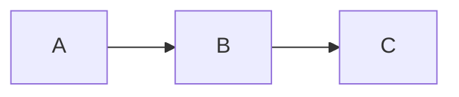

# Contributing to Docs

This guide covers how to add and edit documentation in the Docusaurus site.

## Running Locally

```bash
cd docs
npm install
npm start
```

Opens `localhost:3000` with hot-reload. Changes to `.md` files are reflected immediately.

## File Structure

```
docs/
├── docs/                    # Documentation pages (sidebar content)
│   ├── intro.md             # Landing page for /docs
│   ├── getting-started/     # Setup guides
│   ├── architecture/        # System design and data models
│   ├── infrastructure/      # CI/CD, deployment, environments
│   ├── development/         # Code patterns and conventions
│   ├── api-reference/       # Endpoint contracts
│   ├── contributing/        # Contribution guidelines
│   └── sprint-reviews/      # Sprint reports
├── blog/                    # Blog posts
├── src/pages/               # Custom pages (homepage)
└── docusaurus.config.ts     # Site configuration
```

## Adding a New Doc Page

1. **Create the file** in the appropriate directory, e.g. `docs/development/my-topic.md`

2. **Add frontmatter** at the top:
   ```markdown
   ---
   sidebar_position: 5
   ---
   
   # My Topic Title
   
   Content goes here.
   ```

3. **Set `sidebar_position`** to control ordering within the section (lower = higher in sidebar)

4. **Link it from `intro.md`** in the appropriate section

That's it — the sidebar auto-generates from the filesystem.

## Adding a New Section (Folder)

1. Create the folder, e.g. `docs/new-section/`

2. Add a `_category_.json` file:
   ```json
   {
     "label": "New Section",
     "position": 9
   }
   ```

3. Add your `.md` files inside the folder

## Adding a Blog Post

1. Create a file in `blog/` with the date prefix: `blog/2026-03-15-my-post.md`

2. Add frontmatter:
   ```markdown
   ---
   slug: my-post-slug
   title: "My Post Title"
   authors: [askatlas]
   tags: [sprint]
   ---
   
   First paragraph is the summary shown on the blog index.
   
   <!-- truncate -->
   
   Full content continues here.
   ```

3. Available tags: `sprint`, `update`, `architecture` (defined in `blog/tags.yml`)

## Using Mermaid Diagrams

Wrap diagrams in fenced code blocks with the `mermaid` language:

````markdown

````

Supported diagram types: flowcharts, sequence diagrams, ER diagrams, etc. See [Mermaid docs](https://mermaid.js.org/intro/).

## Building for Production

```bash
npm run build
```

This catches broken links and build errors. Always run this before pushing.

## Deployment

Docs deploy automatically via GitHub Actions when changes to `docs/` are pushed to `main`. The site is hosted on GitHub Pages.
