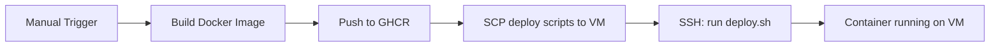

# CI/CD Pipelines

AskAtlas uses GitHub Actions for automated checks, deployments, and documentation publishing.

## Overview

| Workflow | Trigger | Purpose |
|----------|---------|---------|
| `api-checks.yml` | PR touching `api/` | Lint, format, tidy, test, build |
| `web-checks.yml` | PR touching `web/` | Lint, format, typecheck, build |
| `api-deployments.yml` | Manual dispatch | Build → push to GHCR → deploy to VM |
| `web-deployments.yml` | Manual dispatch | Build → push to GHCR → deploy to VM |
| `api-rollback.yml` | Manual dispatch | Rollback API to previous version |
| `web-rollback.yml` | Manual dispatch | Rollback web to previous version |
| `docs-deploy.yml` | Push to `main` (docs/) | Build Docusaurus → deploy to GitHub Pages |

## PR Checks

Checks run automatically on pull requests that touch files in the relevant directory.

### API Checks (`api-checks.yml`)

Triggered by changes to `api/**` or the workflow file itself.

| Job | Command | Purpose |
|-----|---------|---------|
| `lint` | `make lint` | Run `golangci-lint` |
| `formatting` | `make format-check` | Verify `goimports` formatting |
| `tidy` | `make tidy-check` | Verify `go mod tidy` is clean |
| `test` | `make test` | Run unit tests |
| `build` | `make build` | Verify compilation |

### Web Checks (`web-checks.yml`)

Triggered by changes to `web/**` or the workflow file itself.

| Job | Command | Purpose |
|-----|---------|---------|
| `lint` | `make lint` | Run ESLint |
| `formatting` | `make format-check` | Verify Prettier formatting |
| `typecheck` | `make typecheck` | TypeScript type checking |
| `build` | `make build` | Production build (with Infisical for env vars) |

> The web build job installs the Infisical CLI in CI to inject `NEXT_PUBLIC_*` environment variables at build time.

## Deployment Workflows

Deployments are manually triggered via `workflow_dispatch` with an environment selector (`dev`, `stage`, `prod`).

### Flow



Both `api-deployments.yml` and `web-deployments.yml` follow the same two-job pattern:

1. **Build job** — Checkout → login to GHCR → build Docker image → push with SHA and environment tags
2. **Deploy job** — Copy deploy scripts to VM via SCP → execute `deploy.sh` via SSH

### Docker Image Tags

Each build produces two tags:
- `sha-<full-commit-hash>` — immutable, tied to exact commit
- `<branch>-<env>-latest` — mutable, always points to the latest deploy for that environment

### Web Build Differences

The web deployment passes Infisical credentials as Docker build args so `NEXT_PUBLIC_*` variables are available during `next build`:

```yaml
build-args: |
  INFISICAL_MACHINE_CLIENT_ID=${{ secrets.INFISICAL_WEB_CLIENT_ID }}
  INFISICAL_MACHINE_CLIENT_SECRET=${{ secrets.INFISICAL_WEB_CLIENT_SECRET }}
  PROJECT_ID=${{ secrets.INFISICAL_WEB_PROJECT_ID }}
  INFISICAL_SECRET_ENV=${{ steps.infisical-env.outputs.value }}
```

## Rollback Workflows

Rollback workflows are manually triggered with the same environment selector. They execute `rollback.sh` on the VM, which swaps the running container back to the previously deployed image.

See [Deployment](./deployment) for details on the tag rotation and rollback mechanism.

## Docs Deployment

`docs-deploy.yml` triggers on push to `main` when files in `docs/` change. It builds the Docusaurus site and deploys to GitHub Pages via `actions/deploy-pages`.
