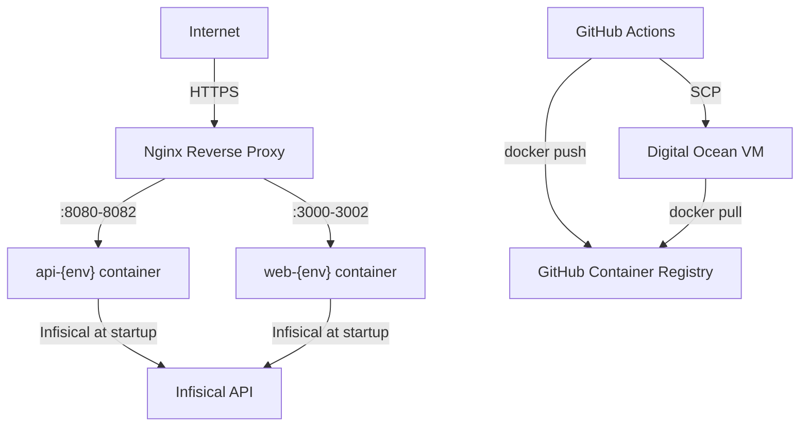

# Deployment

AskAtlas deploys to a **Digital Ocean** VM using Docker containers. Deployments are triggered via GitHub Actions and executed over SSH.

## Deployment Flow



## Deploy Script (`scripts/deploy.sh`)

The deploy script runs on the VM via SSH. It takes three arguments: `<environment> <app> <image-tag>`.

### Steps

1. **Login to GHCR** — Authenticates with the GitHub Container Registry
2. **Pull the new image** — `docker pull ghcr.io/ask-atlas/<app>:<tag>`
3. **Rotate tags** — If a `<app>:<env>-latest` image exists, tag it as `<app>:<env>-previous` (for rollback)
4. **Tag the new image** as `<app>:<env>-latest`
5. **Deploy the container** — Stop old container, remove it, start new one with resource limits and Infisical credentials
6. **Health check** — Wait up to 300 seconds for the container to reach `running` state. If it exits or times out, the deployment fails.
7. **Prune dangling images** — Clean up old layers

### Container Configuration (`scripts/deploy-common.sh`)

#### Port Mapping

Each app and environment has a dedicated port. Ports are defined in `deploy-common.sh` — check the script for current values.

#### Memory Limits

Memory limits and reservations scale by environment (dev < stage < prod). See `deploy-common.sh` for current values.

#### Container Naming

Containers follow a `<app>-<env>` naming convention.

### Container Runtime

Each container runs with:
- `--restart unless-stopped` — Auto-restart on crash
- Memory limits and reservations per environment
- Infisical credentials as environment variables

## Secret Injection

Secrets are injected at container startup, **not** baked into the image.

### API (`api/start.sh`)

```bash
#!/bin/sh
export INFISICAL_TOKEN=$(infisical login --method=universal-auth \
  --client-id="$INFISICAL_MACHINE_CLIENT_ID" \
  --client-secret="$INFISICAL_MACHINE_CLIENT_SECRET" \
  --plain --silent)
exec infisical run --token "$INFISICAL_TOKEN" \
  --projectId "$PROJECT_ID" --env "$INFISICAL_SECRET_ENV" -- /api
```

### Web (`web/start.sh`)

Same pattern but runs `node server.js` (Next.js standalone output).

### Web Build (`web/build.sh`)

The web build also uses Infisical to inject `NEXT_PUBLIC_*` variables at Docker build time (these are baked into the JS bundle by Next.js).

## Dockerfiles

Both services use **multi-stage builds** and run as **non-root users**.

### API Dockerfile

| Stage | Base | Purpose |
|-------|------|---------|
| `builder` | `golang:1.24-alpine` | Compile Go binary |
| `production` | `alpine:3.20` | Minimal runtime with Infisical CLI |

### Web Dockerfile

| Stage | Base | Purpose |
|-------|------|---------|
| `deps` | `node:22-alpine` | Install dependencies |
| `builder` | `node:22-alpine` | Build with Infisical for env vars |
| `runner` | `node:22-alpine` | Standalone output with Infisical CLI |

## Rollback (`scripts/rollback.sh`)

The rollback script swaps the running container back to the previous image.

### Steps

1. Verify the `<app>:<env>-previous` tag exists
2. Stop and remove the current container
3. Deploy using the previous image
4. Re-tag the previous image as `<app>:<env>-latest`

### Usage

Rollbacks are triggered via the `api-rollback.yml` or `web-rollback.yml` GitHub Actions workflows.

> **Note:** Only one level of rollback is available. The `previous` tag always points to the image immediately before the current `latest`.

## Infisical Environment Mapping

Infisical CLI uses different environment names than our deploy environments:

| Deploy Env | Infisical Env |
|-----------|---------------|
| `dev` | `dev` |
| `stage` | `staging` |
| `prod` | `prod` |

## Nginx Reverse Proxy

Nginx runs on the VM as a reverse proxy, routing public traffic to the correct container based on the request's domain/subdomain.

### How It Works

Each environment has its own subdomain. Nginx listens on port 443 (HTTPS) and proxies requests to the appropriate container port based on the `server_name` directive. The exact port-to-subdomain mapping is defined in the nginx config on the VM.

### SSL/TLS

SSL certificates are managed by [Certbot](https://certbot.eff.org/) (Let's Encrypt). Certbot auto-renews certificates and updates the nginx config.

```bash
# Initially set up with:
sudo certbot --nginx -d <domain>

# Auto-renewal is handled by a systemd timer
sudo certbot renew --dry-run
```

### Typical Server Block

```nginx
server {
    listen 443 ssl;
    server_name <subdomain>;

    ssl_certificate     /etc/letsencrypt/live/<domain>/fullchain.pem;
    ssl_certificate_key /etc/letsencrypt/live/<domain>/privkey.pem;

    location / {
        proxy_pass http://localhost:<port>;
        proxy_set_header Host $host;
        proxy_set_header X-Real-IP $remote_addr;
        proxy_set_header X-Forwarded-For $proxy_add_x_forwarded_for;
        proxy_set_header X-Forwarded-Proto $scheme;
    }
}
```

The exact domains and ports are configured per environment. Contact the team lead for specific VM access and nginx configuration.

### DNS

The domain is managed via Namecheap. DNS records point subdomains to the Digital Ocean VM's IP address. The specific subdomain structure is managed internally — contact the team lead for details.

### Adding a New Environment or Service

1. Add a new `server` block in `/etc/nginx/sites-available/`
2. Symlink to `/etc/nginx/sites-enabled/`
3. Run `sudo certbot --nginx -d <new-subdomain>` for SSL
4. Test with `sudo nginx -t` and reload with `sudo systemctl reload nginx`
